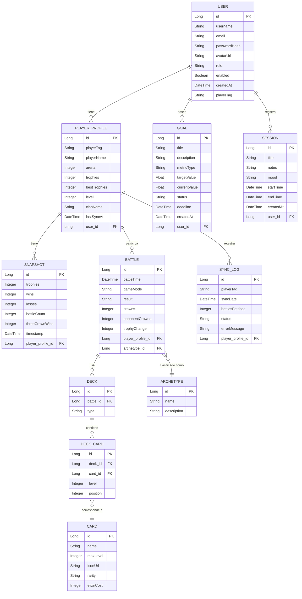

# Backend CRCoach
API del proyecto CRCoach para el proyecto CRCoach.

## Diagrama de Entidades y Relaciones (ER)


## peticion de prueba con curl
```bash
curl -X GET "https://api.clashroyale.com/v1/players/%23${CLASH_ROYALE_PLAYER_TAG}" -H "Authorization: Bearer ${CLASH_ROYALE_API_KEY}"
```


## Despliegue local con Docker Compose

Pasos rápidos para levantar el backend y la base de datos en local usando Docker Compose.

1) Copia el fichero de ejemplo de variables de entorno y edítalo con tus valores locales (si ya existe un `.env`, revisa que no contenga credenciales públicas):

```bash
cp .env.example .env
# Edita .env y ajusta PGHOST/PGPORT/PGDATABASE/PGUSER/PGPASSWORD si quieres usar Postgres local
```

2) Levanta los contenedores (construye la imagen del backend si fuera necesario):

```bash
docker compose up -d --build
```

3) Comprobaciones básicas una vez arrancado:

```bash
docker compose ps
docker compose logs app --tail=200
# Comprobar la especificación OpenAPI (debería responder si la aplicación está lista)
curl -I http://localhost:8080/v3/api-docs
# Descargar la especificación completa
curl -sS http://localhost:8080/v3/api-docs -o openapi.json
```

4) Pruebas rápidas de endpoints (si tienes un token JWT válido):

```bash
curl -sS http://localhost:8080/api/v1/player_profiles -H "Authorization: Bearer <TOKEN>"
```

Troubleshooting básico:
- Si `docker compose ps` muestra que Postgres no está healthy, revisa `docker compose logs postgres-db` para ver errores de arranque.
- Si la aplicación falla por conexión a la BBDD, revisa las variables `PGHOST`, `PGPORT`, `PGDATABASE`, `PGUSER` y `PGPASSWORD` en tu `.env`.
- Si la ruta `/v3/api-docs` devuelve 401/403, la seguridad JWS/JWT puede estar activada; arranca la app con un perfil que desactive seguridad para generar la spec localmente o usa un token válido.

Si quieres que añada un servicio `nginx` en el `docker-compose.yml` para servir como reverse proxy y/o los ficheros estáticos del frontend, lo integro y preparo la configuración y los pasos para HTTPS con Let's Encrypt.


