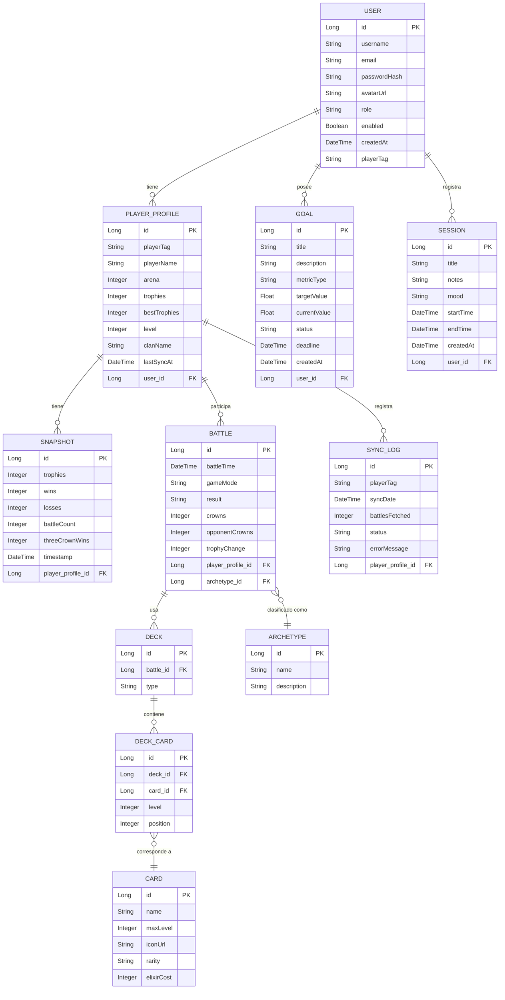

# Backend CRCoach

[](https://spring.io/projects/spring-boot)
[](https://jdk.java.net/21/)
[](https://www.postgresql.org/)
[](https://jwt.io/)
[](https://swagger.io/)
[](https://docker.com)
[](LICENSE)

API REST de **CRCoach**, plataforma de análisis y coaching para Clash Royale. Construida con Spring Boot 4.0.3 y Java 21, proporciona los endpoints necesarios para la gestión de jugadores, partidas, objetivos, sesiones y análisis de rendimiento.

---

## Tabla de Contenidos

- [Características](#características)
- [Stack Tecnológico](#stack-tecnológico)
- [Modelo de Datos (ER)](#modelo-de-datos-er)
- [Estructura del Proyecto](#estructura-del-proyecto)
- [Prerrequisitos](#prerrequisitos)
- [Instalación y Ejecución](#instalación-y-ejecución)
  - [Con Docker (recomendado)](#con-docker-recomendado)
  - [Sin Docker](#sin-docker)
- [Variables de Entorno](#variables-de-entorno)
- [Documentación API](#documentación-api)
- [Despliegue](#despliegue)
- [Contribución](#contribución)
- [Licencia](#licencia)

---

## Características

- **API RESTful** — Endpoints CRUD para todas las entidades del dominio.
- **Autenticación JWT** — Registro, login y recuperación de contraseña con tokens JWT.
- **Analítica de rendimiento** — Clasificación automática de arquetipos, detección de cartas problemáticas y reportes de debilidades.
- **Sincronización con Clash Royale API** — Obtención de datos reales de jugadores mediante WebClient reactivo.
- **Notificaciones** — Sistema de notificaciones push y email (SMTP vía Brevo).
- **Gestión de objetivos** — Metas personalizadas con seguimiento de progreso.
- **Snapshots de progreso** — Capturas periódicas del estado del jugador.
- **Documentación OpenAPI** — Especificación Swagger 3.0 interactiva.
- **Seguridad** — Filtros JWT, CORS configurable, protección de rutas por rol.

---

## Stack Tecnológico

| Tecnología | Versión | Propósito |
|-----------|---------|-----------|
| Java | 21 | Lenguaje principal |
| Spring Boot | 4.0.3 | Framework base |
| Spring Web | — | Controladores REST |
| Spring Data JPA | — | ORM con Hibernate |
| Spring Security | — | Autenticación y autorización |
| Spring Validation | — | Validación de DTOs (Jakarta) |
| Spring Mail | — | Envío de emails |
| Spring WebFlux | — | WebClient reactivo para Clash Royale API |
| PostgreSQL | 15 | Base de datos principal |
| MySQL | — | Alternativa de base de datos |
| H2 | — | Base de datos en memoria para tests |
| JJWT | 0.11.5 | Creación y validación de JWT |
| Lombok | — | Reducción de código boilerplate |
| SpringDoc OpenAPI | 3.0.2 | Documentación Swagger/OpenAPI |
| Thymeleaf | — | Plantillas de email |
| JUnit / Mockito | — | Tests unitarios |
| Maven | Wrapper 3.9.6 | Build y dependencias |

---

## Modelo de Datos (ER)



---

## Estructura del Proyecto

```
Backend-CRCoach/
├── docs/                                    # Documentación API
│   ├── API-SPEC.md                          # Especificación en markdown
│   ├── index.html                           # ReDoc UI
│   ├── openapi.json                         # OpenAPI 3.0 schema
│   └── README.md                            # Guía de documentación
├── src/
│   ├── main/
│   │   ├── java/org/example/backendcrcoach/
│   │   │   ├── BackendCrCoachApplication.java    # Entry point
│   │   │   ├── analytics/                        # Análisis y clasificación
│   │   │   │   ├── AnalyticsController.java
│   │   │   │   ├── AnalyticsService.java
│   │   │   │   ├── ArchetypeClassifier.java
│   │   │   │   ├── Archetype.java
│   │   │   │   └── dto/                          # ArchetypeStat, PlayerSummary,
│   │   │   │                                       ProblematicCard, WeaknessReport
│   │   │   ├── config/                           # Configuraciones
│   │   │   │   ├── AsyncConfig.java              # Hilos asíncronos
│   │   │   │   ├── OpenApiConfig.java            # Swagger/OpenAPI
│   │   │   │   ├── WebClientConfig.java          # Cliente HTTP reactivo
│   │   │   │   └── WebClientHelper.java          # Utilidades WebClient
│   │   │   ├── domain/
│   │   │   │   ├── dto/                          # 48 DTOs (Request/Response)
│   │   │   │   ├── entities/                     # 30 entidades JPA
│   │   │   │   └── enums/                        # GoalStatus, Role
│   │   │   ├── mappers/                          # 22 mappers Entity ↔ DTO
│   │   │   ├── repositories/                     # 28 repositorios Spring Data JPA
│   │   │   ├── security/                         # Seguridad y autenticación
│   │   │   │   ├── controller/AuthController.java
│   │   │   │   ├── dto/                          # AuthResponse, UserLoginDTO, UserRegisterDTO
│   │   │   │   ├── jwt/                          # JwtRequestFilter, JwtUtil
│   │   │   │   ├── user/                         # CustomUserDetails, CustomUserDetailsService
│   │   │   │   ├── SecurityConfig.java
│   │   │   │   └── AuthenticationSuccessListener.java
│   │   │   ├── services/                         # 28 servicios de negocio
│   │   │   │   ├── EmailService.java             # Interfaz de email
│   │   │   │   ├── EmailServiceImpl.java         # SMTP estándar
│   │   │   │   ├── EmailServiceBrevoImpl.java    # Brevo API
│   │   │   │   ├── FileService.java              # Subida de archivos
│   │   │   │   ├── TokenBlacklistService.java    # Blacklist de JWT
│   │   │   │   └── PasswordResetService.java     # Reset de contraseña
│   │   │   └── web/
│   │   │       ├── controllers/                  # 26 controladores REST
│   │   │       ├── exceptions/                   # Excepciones personalizadas + GlobalExceptionHandler
│   │   │       └── filters/                      # RequestRedirectFilter
│   │   └── resources/
│   │       ├── static/
│   │       ├── templates/                        # Plantillas Thymeleaf (emails)
│   │       └── application.properties
│   └── test/
│       └── java/org/example/backendcrcoach/
├── uploads/                               # Archivos subidos por usuarios
├── app/uploads/                           # Montura Docker para uploads
├── docker-compose.yml                     # PostgreSQL + App
├── Dockerfile                             # Multi-stage build (Maven → JRE Alpine)
├── nginx.conf                             # Reverse proxy (opcional)
├── pom.xml                                # Dependencias Maven
├── mvnw / mvnw.cmd                        # Maven wrapper
├── .env.example                           # Plantilla de variables de entorno
├── qodana.yaml                            # Configuración Qodana
├── .github/
│   └── workflows/                         # CI/CD pipelines
│       ├── workflow.yml                   # CI básico
│       ├── codeql.yml                     # Análisis de seguridad
│       ├── qodana_code_quality.yml        # Calidad de código
│       └── deploy-docs.yml               # Publicación de documentación
├── LICENSE                                # MIT
├── README.md                              # Este archivo
└── SECURITY.md
```

---

## Prerrequisitos

| Herramienta | Versión mínima |
|------------|---------------|
| Java JDK | 21 |
| Maven | 3.9.x (o usar `./mvnw`) |
| PostgreSQL | 15 |
| Docker | 24+ (opcional) |
| Docker Compose | 2.20+ (opcional) |

---

## Instalación y Ejecución

### Con Docker (recomendado)

```bash
# 1. Clonar el repositorio
git clone https://github.com/tu-usuario/CRCoach.git
cd CRCoach/Backend-CRCoach

# 2. Configurar variables de entorno
cp .env.example .env
# Editar .env con tus credenciales (PGUSER, PGPASSWORD, JWT_SECRET, etc.)

# 3. Iniciar PostgreSQL + API
docker compose up -d
```

La API estará disponible en `http://localhost:8080`.

### Sin Docker

```bash
# 1. Requiere PostgreSQL corriendo en local
# 2. Configurar variables de entorno (PGHOST=localhost)
cp .env.example .env

# 3. Compilar
./mvnw clean package -DskipTests

# 4. Ejecutar
java -jar target/Backend-CRCoach-0.0.1-SNAPSHOT.jar
```

---

## Variables de Entorno

Archivo `.env` basado en [`.env.example`](.env.example):

### Base de datos

| Variable | Descripción | Ejemplo |
|----------|-------------|---------|
| `PGHOST` | Host de PostgreSQL | `postgres-db` (Docker) / `localhost` |
| `PGPORT` | Puerto | `5432` |
| `PGDATABASE` | Nombre de la base de datos | `crcoach_dev` |
| `PGUSER` | Usuario | `crcoach` |
| `PGPASSWORD` | Contraseña | `supersecret` |

### Servidor

| Variable | Descripción | Ejemplo |
|----------|-------------|---------|
| `PORT` | Puerto de la API | `8080` |
| `NODE_ENV` | Entorno | `development` |

### Seguridad JWT

| Variable | Descripción | Ejemplo |
|----------|-------------|---------|
| `JWT_SECRET` | Secreto para firmar tokens | (generar string seguro) |
| `JWT_EXPIRATION_MS` | Expiración del token | `86400000` (24h) |

### Clash Royale API

| Variable | Descripción | Ejemplo |
|----------|-------------|---------|
| `CLASH_ROYALE_API_KEY` | API Key oficial | — |
| `CLASH_ROYALE_API_URL` | URL base de la API | `https://api.clashroyale.com/v1` |
| `CLASH_ROYALE_PLAYER_TAG` | Tag del jugador por defecto | `#ABC123` |

### Email (Brevo)

| Variable | Descripción | Ejemplo |
|----------|-------------|---------|
| `SPRING_HOST` | Servidor SMTP | `smtp-relay.brevo.com` |
| `SPRING_MAIL_USERNAME` | Usuario SMTP | — |
| `SPRING_MAIL_PASSWORD` | Contraseña SMTP | — |
| `BREVO_API_KEY` | API Key de Brevo | — |
| `BREVO_SENDER_EMAIL` | Email remitente | `noreply@crcoach.com` |
| `BREVO_SENDER_NAME` | Nombre remitente | `CRCoach` |

### CORS

| Variable | Descripción | Ejemplo |
|----------|-------------|---------|
| `APP_FRONTEND_BASE_URL` | URL del frontend para CORS | `http://localhost` |

---

## Documentación API

La API REST está documentada con **OpenAPI 3.0** (springdoc-openapi):

- **Swagger UI:** `http://localhost:8080/swagger-ui.html`
- **Especificación OpenAPI:** [`docs/openapi.json`](docs/openapi.json)
- **ReDoc:** [`docs/index.html`](docs/index.html)
- **Markdown:** [`docs/API-SPEC.md`](docs/API-SPEC.md)

### Ejemplo de petición

```bash
# Autenticación
curl -X POST http://localhost:8080/api/v1/auth/authenticate \
  -H "Content-Type: application/json" \
  -d '{"email": "user@example.com", "password": "mypassword"}'

# Obtener perfil del jugador (requiere token)
curl -X GET http://localhost:8080/api/v1/player-profiles/me \
  -H "Authorization: Bearer <token>"
```

---

## Despliegue

### Docker Compose (producción)

```bash
docker compose up -d
```

### Construir y publicar imagen

```bash
docker build -t ricitosdeoro2001/backend-crcoach:latest .
docker push ricitosdeoro2001/backend-crcoach:latest
```

### Dockerfile (multi-stage)

1. **Builder:** `maven:3.9.6-eclipse-temurin-21` — compila y empaqueta el JAR
2. **Runtime:** `eclipse-temurin:21-jre-alpine` — JRE mínimo con G1GC (256m-512m heap)

---

## Contribución

Las contribuciones son bienvenidas. Sigue estos pasos:

1. **Fork** el repositorio.
2. **Crea una rama**:
   ```bash
   git checkout -b feat/mi-nueva-funcionalidad
   ```
3. **Realiza cambios** con commits descriptivos:
   ```bash
   git commit -m "feat: añadir nueva funcionalidad X"
   ```
4. **Ejecuta los tests**:
   ```bash
   ./mvnw test
   ```
5. **Push**:
   ```bash
   git push origin feat/mi-nueva-funcionalidad
   ```
6. Abre un **Pull Request**.

### Convenciones de código

- **Commits:** [Conventional Commits](https://www.conventionalcommits.org/) (`feat:`, `fix:`, `docs:`, `refactor:`)
- **Arquitectura:** Capas estrictas (Controller → Service → Repository), sin saltos
- **DTOs:** Siempre explícitos, nunca exponer entidades JPA en la API
- **Mappers:** Interfaz dedicada por entidad (MapStruct style manual)
- **Excepciones:** Personalizadas por recurso, manejadas globalmente por `GlobalExceptionHandler`
- **Seguridad:** JWT en header `Authorization: Bearer <token>`

---

## Licencia

Distribuido bajo licencia MIT. Ver [LICENSE](LICENSE).

## Enlaces
- Prototipo en Figma: https://www.figma.com/design/VztmIawRHGdIuaUTIr0zf5/proyecto-CRCoach?m=auto&t=5PKLQ0HYuDcRaECw-1
- Repositorio del frontend: https://github.com/ricitos2001/Frontend-CRCoach.git
- Repositorio del backend: https://github.com/ricitos2001/Backend-CRCoach.git
- URL del frontend: https://frontend-crcoach.onrender.com
- URL del backend: https://backend-crcoach.onrender.com
- Documentación del frontend desplegada con github pages: https://ricitos2001.github.io/Backend-CRCoach/
- Documentación del frontend desplegada con github pages: https://ricitos2001.github.io/Frontend-CRCoach/