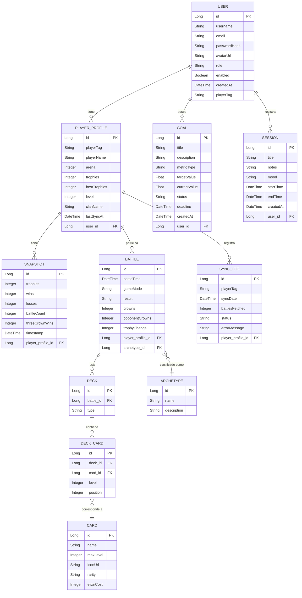

# Backend CRCoach
API del proyecto CRCoach para el proyecto CRCoach.

## Diagrama de Entidades y Relaciones (ER)


## peticion de prueba con curl
```bash
curl -X GET "https://api.clashroyale.com/v1/players/%23${CLASH_ROYALE_PLAYER_TAG}" -H "Authorization: Bearer ${CLASH_ROYALE_API_KEY}"
```

